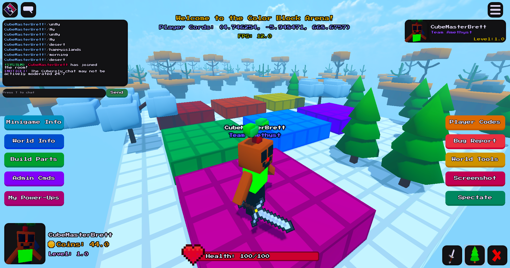

<html>
  <body>
    
    <h1>Hi, I'm Brett.</h1>
    
I'm a 16 year old game developer from Texas.

    
I started off doing game development on <a href="https://roblox.com">Roblox</a>, but I stopped after my account was terminated. I still continue to build video games, but I usually do my gamedev work outside of Roblox. I'm also capable of handling tasks outside of game development, such as web development & app development.

     
    
I primarily utilize the <a href="https://godotengine.org">Godot Engine</a> for game development & app development and I use <a href="https://expressjs.org">Express.js</a> to work with backend. I usually create websites that go together with my games.
  </body>
</html>

<!--
**PlasmaticSquid/PlasmaticSquid** is a ✨ _special_ ✨ repository because its `README.md` (this file) appears on your GitHub profile.

Here are some ideas to get you started:

- 🔭 I’m currently working on ...
- 🌱 I’m currently learning ...
- 👯 I’m looking to collaborate on ...
- 🤔 I’m looking for help with ...
- 💬 Ask me about ...
- 📫 How to reach me: ...
- 😄 Pronouns: ...
- ⚡ Fun fact: ...
-->
